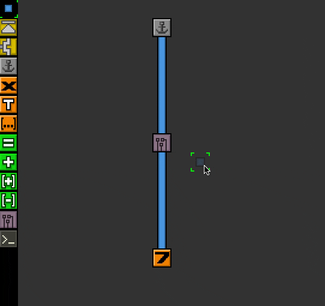
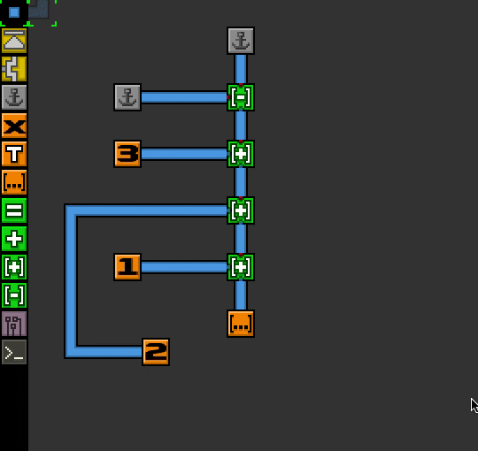

## ton-lang

ton-lang is a visual programming language whose interpreter is implemented as a
cellular automaton, meaning that each cell is transformed at every frame
depending on its direct neighbors.

Evaluating programs as cellular automata gives some interesting features such as
partial evaluation. On the other hand some features can be hard to implement —
at least the way I've approached the problem — e.g. I'm still trying to figure
out how to implement recursion.
 
## Usage

### CLI

- Creating a new file: `ton new <path>`
- Editing an existing file: `ton edit <path>`
- (Upcoming) Render the evaluation of a program as a gif: `ton run
  <program-path> <gif-output-path>`
  
### Editor

#### Cells

Cells are divided in three main categories:
- Links: wires connecting cells, visually "pulling" values to processors
- Processors: cells that actually do computations, inputs are shown as blue pins
  and outputs as red pins, drawn on the border of the cell.
- Values: for now only booleans, integers and lists

Additionally, programs can be separated in modules with "chips", which are
basically sub-programs.

Eventually I'd like to implement quotes (as in e.g. lisp) which would make
processors behave as values temporarily (and therefore movable through wires)

### Controls

- Left-click: write the selected cell
- Right-click: delete the pointed cell
- Scrolling: change the cell type in the toolbar
- Ctrl+S: save the current program
- Ctrl+R: reload the program from disk (going back to the last saved state)
- Ctrl+Q: quit the editor
- Ctrl+L: Clears the board
- s+scroll: switch the state of the cell, which depends on the pointed cell
  (cycles through values for value-cells, rotates the pins for processor-cells)
- Space: evaluates 1 step
- Enter: evaluate continuously (toggle)
- Tab: edit the selected chip
- Esc: go to parent program
- Shift+Esc: go to root program
- M: save selected chip to toolbar
- D: print JSON-representation of a cell in the console for debugging
- I: shows information about a cell directly in the editor

## Examples

